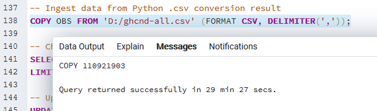

# NOAA_GHCND_IMPORT
 Python scripts to import the NOAA Global Historical Climate Network Daily (GHCN-D) for big data anlaysis

## How to run the script

Best course of action: select a few of the `.dly` files, put them into a folder, and test this
script on that subset before attempting on the entire ~120,000 `.dly` files.

LINK TO DATA FILES - download "ghcnd_all.tar.gz" --> ftp://ftp.ncdc.noaa.gov/pub/data/ghcn/daily

### Step 0: Read the doc about data structure, contents, etc.
Highly recommended, at least skim it.   [CLICK LINK TO SEE .TXT FILE](./NOAA_GHCN_README.txt)

### Step 1: Imports
We'll need pandas and glob.

```python
import pandas as pd
import glob
```

### Step 2: Set path to folder with `.dly` files
Running the `glob` command here makes a list of all the file names in this folder, which we use later on to concat the
files together.

```python
''' Change paths to your local destination for extracted tarball files '''
# Concat all .dly files in directory together
# Credit: https://stackoverflow.com/questions/17749058/

read_files = glob.glob("D:/ghcnd_all/*.dly")
```

### Step 3: Combine all `.dly` file contents into one massive `.txt` file
This for loop glues all the contents of all the `.dly` files end-to-end, without blank rows in between.

```python
with open("D:/result.txt", "wb") as outfile:
    for f in read_files:
        with open(f, "rb") as infile:
            outfile.write(infile.read())
```

### Step 4: Read fixed-width file, convert and append chunks to one `.csv` file
There are two pieces to this step.  First we need to read the giant `.txt` file that we just made above (`result.txt`),
then read that based on a fixed-width format (using Pandas `read_fwf`), THEN convert that to `.csv` and export in CHUNKS.

If you try to export this all as one instead of appending to the same file in chunks, changes are your computer will crash.

Note that this step takes about 5 hours on a 2019 Macbook, and roughly 2 hours on a DELL 7559 w/16gb RAM and GTX960M.  It's
30gb, give it time.  You can always check the size of the `gnchd-all.csv` file to see how far along the progress is.

```python
for chunk in pd.read_fwf('D:/result.txt',
                widths=[11,4,2,4,5,1,1,1,5,1,1,1,5,1,1,1,5,1,1,1,5,1,1,1,5,1,1,1,5,1,1,1,5,1,1,1,5,1,1,1,5,1,1,1
                        ,5,1,1,1,5,1,1,1,5,1,1,1,5,1,1,1,5,1,1,1,5,1,1,1,5,1,1,1,5,1,1,1,5,1,1,1,5,1,1,1
                        ,5,1,1,1,5,1,1,1,5,1,1,1,5,1,1,1,5,1,1,1,5,1,1,1,5,1,1,1,5,1,1,1,5,1,1,1,5,1,1,1,5,1,1,1],
                        header=None, chunksize=15000):
    
    chunk.to_csv('D:/ghcnd-all.csv',
                       mode='a', sep=',', encoding='utf-8', header=None)
```


### BONUS Step 5: Import into PostgreSQL database (or similar)

Including this here simply because it takes SO long due to each day having it's own set of 4 columns, so hopefully
somebody somewhere can use this and save 15 minutes of straight typing.  Note this is a `.sql` file so cannot be run 
in Python.

#### Note common problem "Could not stat file"
If you get an error from Postgres about "could not stat file", download Postgres 10 and load up the database on that
version instead of Postgres 12.

Proof that this works... over 110 million rows...


Note: due to some `.dly` files parsing SF# as "0.0" instead of a single character, I have made
this CHAR(3).  This is a very random anomaly (ie I'll start the ingestion, and it'll break at the 
39 millionth row because of this), and I can't find any other work around.  So far I have not seen any issues 
allowing a few extra characters in the SF# columns.

```SQL
-- Ingest full data ".dly" files
-- Create staging table OBS

CREATE TABLE OBS (
	OBSNum INTEGER PRIMARY KEY NOT NULL,
	StationID CHAR(11) NOT NULL,
	Year INTEGER NOT NULL,
	Month INTEGER NOT NULL,
	Element CHAR(4) NOT NULL,
	V1 INTEGER,
	MF1 CHAR(1),
	QF1 CHAR(1),
	SF1 CHAR(3),
	V2 INTEGER,
	MF2 CHAR(1),
	QF2 CHAR(1),
	SF2 CHAR(3),
	V3 INTEGER,
	MF3 CHAR(1),
	QF3 CHAR(1),
	SF3 CHAR(3),
	V4 INTEGER,
	MF4 CHAR(1),
	QF4 CHAR(1),
	SF4 CHAR(3),
	V5 INTEGER,
	MF5 CHAR(1),
	QF5 CHAR(1),
	SF5 CHAR(3),
	V6 INTEGER,
	MF6 CHAR(1),
	QF6 CHAR(1),
	SF6 CHAR(3),
	V7 INTEGER,
	MF7 CHAR(1),
	QF7 CHAR(1),
	SF7 CHAR(3),
	V8 INTEGER,
	MF8 CHAR(1),
	QF8 CHAR(1),
	SF8 CHAR(3),
	V9 INTEGER,
	MF9 CHAR(1),
	QF9 CHAR(1),
	SF9 CHAR(3),
	V10 INTEGER,
	MF10 CHAR(1),
	QF10 CHAR(1),
	SF10 CHAR(3),
	V11 INTEGER,
	MF11 CHAR(1),
	QF11 CHAR(1),
	SF11 CHAR(3),
	V12 INTEGER,
	MF12 CHAR(1),
	QF12 CHAR(1),
	SF12 CHAR(3),
	V13 INTEGER,
	MF13 CHAR(1),
	QF13 CHAR(1),
	SF13 CHAR(3),
	V14 INTEGER,
	MF14 CHAR(1),
	QF14 CHAR(1),
	SF14 CHAR(3),
	V15 INTEGER,
	MF15 CHAR(1),
	QF15 CHAR(1),
	SF15 CHAR(3),
	V16 INTEGER,
	MF16 CHAR(1),
	QF16 CHAR(1),
	SF16 CHAR(3),
	V17 INTEGER,
	MF17 CHAR(1),
	QF17 CHAR(1),
	SF17 CHAR(3),
	V18 INTEGER,
	MF18 CHAR(1),
	QF18 CHAR(1),
	SF18 CHAR(3),
	V19 INTEGER,
	MF19 CHAR(1),
	QF19 CHAR(1),
	SF19 CHAR(3),
	V20 INTEGER,
	MF20 CHAR(1),
	QF20 CHAR(1),
	SF20 CHAR(3),
	V21 INTEGER,
	MF21 CHAR(1),
	QF21 CHAR(1),
	SF21 CHAR(3),
	V22 INTEGER,
	MF22 CHAR(1),
	QF22 CHAR(1),
	SF22 CHAR(3),
	V23 INTEGER,
	MF23 CHAR(1),
	QF23 CHAR(1),
	SF23 CHAR(3),
	V24 INTEGER,
	MF24 CHAR(1),
	QF24 CHAR(1),
	SF24 CHAR(3),
	V25 INTEGER,
	MF25 CHAR(1),
	QF25 CHAR(1),
	SF25 CHAR(3),
	V26 INTEGER,
	MF26 CHAR(1),
	QF26 CHAR(1),
	SF26 CHAR(3),
	V27 INTEGER,
	MF27 CHAR(1),
	QF27 CHAR(1),
	SF27 CHAR(3),
	V28 INTEGER,
	MF28 CHAR(1),
	QF28 CHAR(1),
	SF28 CHAR(3),
	V29 INTEGER,
	MF29 CHAR(1),
	QF29 CHAR(1),
	SF29 CHAR(3),
	V30 INTEGER,
	MF30 CHAR(1),
	QF30 CHAR(1),
	SF30 CHAR(3),
	V31 INTEGER,
	MF31 CHAR(1),
	QF31 CHAR(1),
	SF31 CHAR(3));

-- Ingest data from Python .csv conversion result

-- Used cygwin to remove "-9999" values that should be NULL, do this BEFORE COPY below
-- sed -i -e 's/-9999//g' "ghcnd-all-no9999.csv"
-- OR, set NULL as -9999 in COPY statement in SQL script

COPY OBS FROM 'D:/ghcnd-all-no9999.csv' (FORMAT CSV, DELIMITER(','));
